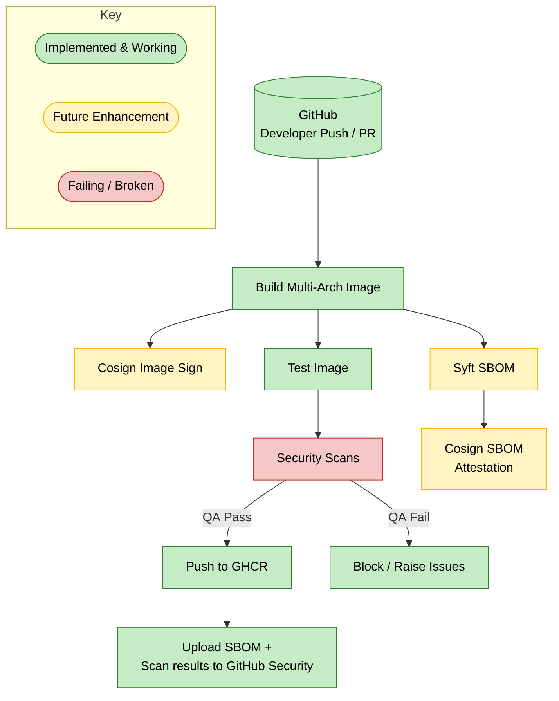

# **terrarium**

## Audience

External contributors & adopters

## Purpose

Immutable dev‑container image for IaC & Cloud Ops

## Overview

<table style="width: 100%; border-style: none;"><tr>
<td style="width: 140px; text-align: center;"> </a></td>
<td>
<strong>terrarium Developer Environment</strong><br />
<i>An immutable Developer Environment for developers working with <b><a href="https://www.opendevstack.org/">OpenDevStacks'</a></b> Cloud Quickstarters.
</td>
</tr></table>

With **terrarium** we offer an immutable Developer Environment for developers working with **[OpenDevStack](https://www.opendevstack.org/)** projects. **terrarium** provides the same environment which is used to deploy AWS or AZURE components via ODS.

By using the Visual Studio Code Remote - Containers extension it enables the developer to open cloud component repositories inside a container and take advantage of Visual Studio Code's full feature set.

This repository contains an example container definition to help get you up and running with **terrarium**. The definition describes the appropriate container image and VS Code extensions that should be installed. A container configuration file (devcontainer.json) and other needed files that you can drop into any existing folder as a starting point for containerizing your project.

## Process Flow



## Usage

If the Cloud Quickstarter does not contain it already simply create a [`.devcontainer`](.devcontainer) directory and put the devcontainer.json into it.

```json
{
  "image": "ghcr.io/nichtraunzer/terrarium:latest"
}
```

## Contents

- [`.devcontainer`](.devcontainer) - Contains a plain devcontainer.json eample.
- [`examples`](examples) - Contains a more sophisticated example.
- [`terraform`](terraform) - Contains the Docker file.
- [`tools`](tools) - Contains an additional prompt example.

## Update the terrarium tools

The tools and libraries of the terrarium toolset have to be updated from time to time.
The following steps have to be performed:

- Check for new versions of tool variables \*\_VERSION in i[Dockerfile.terrarium](./terraform/docker/Dockerfile.terrarium)
- Check for new versions of python libraries in file [python_requirements](./terraform/docker/python_requirements) (might depend on Python Version)
- Check for new versions of the ruby Gems in [Gemfile](./terraform/docker/Gemfile)
- Rebuild the container image
  `$ DOCKER_BUILDKIT=1 docker build -t terrarium:update-tools -f ./Dockerfile.terrarium .`
- Mount the folder with the new toolset and rebuild Gemfile.lock from scratch using `bundle install --jobs=22`
- verify updates with ods-quickstarters/inf-terraform-[aws|azure]
  `docker run -ti --user 1000 -v $HOME/.bash_history:/home/terrarium/.bash_history -v`pwd`:/workspace -v $HOME/.gitconfig:/home/terrarium/.gitconfig -v $HOME/.cache/git/credential/socket:/home/terrarium/.cache/git/credential/socket terrarium:tools-update /bin/bash`
- commit & push changes & create pull request

## Automated Tests with Bats

### Why do we test the image?

`terrarium` is an **immutable developer workstation** pre‑loaded with dozens of tools
(Terraform, AWS CLIs, Packer, Ruby, Go, Node.js …).
Whenever we upgrade one of those tools or tweak **`Dockerfile.terrarium`** we risk
breaking somebody’s workflow.

To catch such regressions early the image ships its own **Bats** test‑suite that
runs _inside_ the container during local builds **and** in CI.
If a single assertion fails, the build (and the GitHub Action) stops – before a
faulty image can be pushed.

- **Framework:** [Bats – Bash Automated Testing System](https://github.com/bats-core/bats-core) +
  helper libs **bats‑support** and **bats‑assert**
- **Philosophy:** ultra‑fast _smoke_ tests – “does the binary exist and print the
  expected version?”
- **Where:** `terraform/docker/tests/…`

---

### Test layout

```text
terraform/docker/tests/
├── 00_core.bats            # OS basics, Python, jq, GNU parallel …
├── 20_infra.bats           # Consul, Packer, Sops, age‑keygen …
├── 30_aws.bats             # aws, sam, cdk CLIs
├── 40_terraform.bats       # Terraform via tenv, tflint, terraform‑docs …
├── 50_ruby_ecosystem.bats  # rbenv, Ruby, Bundler, Kitchen, Cinc …
├── 60_k8s.bats             # kubectl, helm (skipped if absent)
└── 90_extras.bats          # Go, go‑task, starship, yq, zoxide

```

Each file groups related checks so failures immediately point to the affected
tool‑chain.

### Running the suite locally

#### 1 – Build the image and let Docker run the tests

Run every stage up to and including “test”

```bash
docker build \
  --target test \
  --tag terrarium:test \
  -f terraform/docker/Dockerfile.terrarium \
  terraform/docker
```

If any Bats assertion fails the build exits non‑zero – just like CI.

The JUnit report generated by Bats is written to

```text
/home/terrarium/junit-report.xml inside the test container.
```

#### 2 – Test an already‑built image

docker run --rm -it ghcr.io/nichtraunzer/terrarium:latest \
 bash -lc "bats --report-formatter pretty /home/terrarium/tests"

### What exactly gets checked?

| Category        | Representative assertions (excerpt)                                    |
| --------------- | ---------------------------------------------------------------------- |
| **Core OS**     | Image reports _Rocky Linux 8_, `python --version` works                |
| **AWS tooling** | `aws`, `sam`, `cdk` binaries present and runnable                      |
| **Terraform**   | Required TF versions installed via **tenv**, `tflint, tfsec` available |
| **Infra/Sec**   | `sops --version`, `age-keygen` creates a keyfile                       |
| **Ruby stack**  | `ruby`, `bundler`, `kitchen` CLI present                               |
| **Extras**      | `starship`, `yq`, `zoxide`, `go-task` print their version strings      |

These fast, deterministic checks give us confidence to publish multi‑arch images
(linux/amd64 and linux/arm64) without manual verification.

### Continuous Integration flow

1. GitHub Actions (.github/workflows/main.yaml) builds the image for both
   architectures.

2. During the build the test stage executes the Bats suite.
   Any failure aborts the workflow immediately.

3. On merges into master or on tagged releases the already‑tested image
   is pushed to GHCR (ghcr.io/<owner>/terrarium).

### Adding or modifying tests

1. Copy the most relevant \*.bats file (e.g. 40_terraform.bats) or create a
   new one named NN_description.bats (NN keeps numeric ordering).

2. Follow the pattern:

```bash
#!/usr/bin/env bats
load 'test_helper/common.bash'

@test "Terraform is installed" {
  run terraform -version
  assert_success
}
```

Commit & push – the GitHub Action will tell you whether the test
(or the image!) needs changes.

## Branching & Release Strategy

This repository uses semantic-release to fully automate version management and changelog generation.
Releases are determined only by commit messages following the Conventional Commits specification.

### Branch Roles

| Branch         | Release Type          | Version Pattern | Notes                                                                                                      |
| -------------- | --------------------- | --------------- | ---------------------------------------------------------------------------------------------------------- |
| `main`         | **Stable**            | `x.y.z`         | Production-ready releases. Published to the default (`latest`) channel.                                    |
| `develop`      | **Prerelease (beta)** | `x.y.z-beta.N`  | Used for integration testing. Published to the `beta` channel.                                             |
| `feature/*`    | No release            | —               | For development only. Builds/test snapshots may be pushed for PRs, but no semantic-release publish occurs. |
| Other branches | No release            | —               | Treated like feature branches unless explicitly added to the `.releaserc` configuration.                   |

### How Versions Are Determined

- Stable releases: Created from main when commits contain fix, feat, or a breaking change (BREAKING CHANGE: in body or ! in header).

- Beta prereleases: Created from develop with the next planned main version and a -beta.N suffix.

- Feature branches: No semantic-release run; CI may still build and publish branch-specific artifacts (e.g., Docker images for PR review).

Key Points

- Never commit directly to main – all changes should flow through develop → main.

- Do not merge develop into main unless you intend to trigger a stable release.

- Do not expect feature branches to produce installable npm/GitHub releases – they’re for development only.

- Semantic-release determines the next version by looking at the latest tag on the target branch and all commits since that tag.
